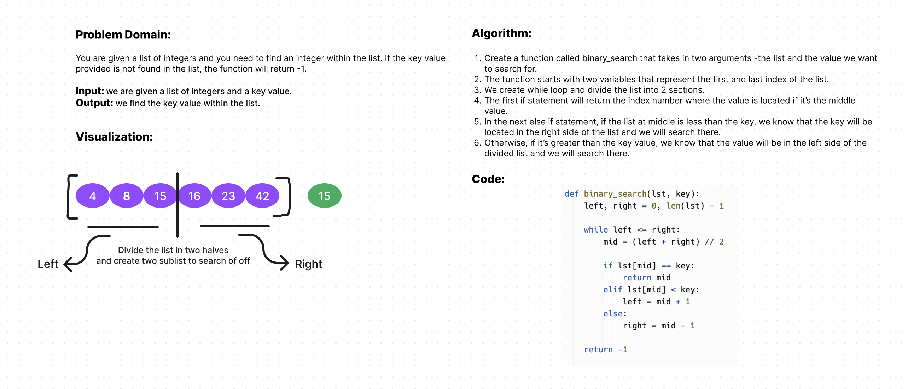

# Challenge Title
List Binary Search

## Whiteboard Process

## Approach & Efficiency
This approach is called binary search and what it does is to divide the list into two sub-lists, so the search can be
narrowed down.

## Solution

 - [x] Top-level README “Table of Contents” is updated
 - [x] README for this challenge is complete
       - [x] Summary, Description, Approach & Efficiency, Solution
       - [x] Picture of whiteboard
       - [x] Link to code
 - [x] Feature tasks for this challenge are completed
 - [ ] Unit tests written and passing
       - [ ] “Happy Path” - Expected outcome
       - [ ] Expected failure
       - [ ] Edge Case (if applicable/obvious)
