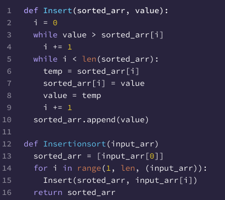

# Blog Notes: Insertion Sort

### Pseudo code review:

------------

    Insert(int[] sorted, int value)
      initialize i to 0
      WHILE value > sorted[i]
        set i to i + 1
      WHILE i < sorted.length
        set temp to sorted[i]
        set sorted[i] to value
        set value to temp
        set i to i + 1
      append value to sorted

    InsertionSort(int[] input)
      LET sorted = New Empty Array
      sorted[0] = input[0]
      FOR i from 1 up to input.length
        Insert(sorted, input[i])
      return sorted
------------

#### Line by line explanation:

1. The first line defines a function called 'Insert' that takes in two parameters:an array called 'sorted' and the
integer 'value'.
2. Next we initialize the variable 'i' at 0.
3. The first while loop iterates as long as the 'value' is greater than the element at index 'i' in the 'sorted' array.
It increments 'i' by one in each iteration until the condition is no longer satisfied.
4. The second while loop iterates as long as 'i' is less than the length of the 'sorted' array. It performs a swap
operation between 'value' and each element in the 'sorted' array from index 'i' onwards. The original value at index 'i'
is stored in a temporary variable 'temp', 'value' is assigned to the element at index 'i', and temp is assigned to
'value'.
5. After the while loop, the next line appends the final value to the 'sorted' array.
6. The next line defines a function called 'InsertionSort' that takes in an array 'input' as a parameter.
7. The next two lines initializes an empty array called 'sorted' and assigns the first element of the 'input' array to
'sorted[0]'.
8. The for loop iterates over the elements of the 'input' array starting from the second element (idx1). It calls the
'Insert' function for each element, passing the 'sorted' array and the current element as arguments.
9. To finish, ir returns the 'sorted' array.

#### Visually show the output of processing the following input array: [8,4,23,42,16,15]

1. Initially, the sorted array is empty.
2. We start with the first element, 8.

--> The sorted array becomes [8].

3. Moving on to the next element, 4.

--> The sorted array becomes [4, 8].

4. Next, we have 23.

--> The sorted array becomes [4, 8, 23].

5. Then, we encounter 42.

--> The sorted array becomes [4, 8, 23, 42].

6. Now, we have 16.

--> The sorted array becomes [4, 8, 16, 23, 42].

7. Finally, we process the last element, 15.

--> The sorted array becomes [4, 8, 15, 16, 23, 42].

After going through all the elements, the final sorted array is [4, 8, 15, 16, 23, 42].

------------
    Step 1: [8] (8 is inserted)
    Step 2: [4, 8] (4 is inserted)
    Step 3: [4, 8, 23] (23 is inserted)
    Step 4: [4, 8, 23, 42] (42 is inserted)
    Step 5: [4, 8, 16, 23, 42] (16 is inserted)
    Step 6: [4, 8, 15, 16, 23, 42] (15 is inserted)
------------

#### Convert the pseudo-code into working code in Python.

