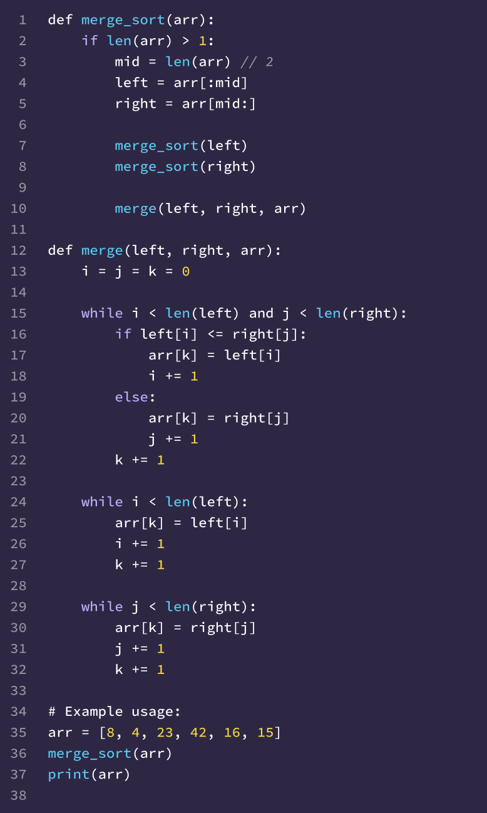

# Blog Notes: Merge Sort

### Pseudo code review:

------------

    ALGORITHM Mergesort(arr)
      DECLARE n <-- arr.length

      if n > 1
        DECLARE mid <-- n/2
        DECLARE left <-- arr[0...mid]
        DECLARE right <-- arr[mid...n]
        // sort the left side
        Mergesort(left)
        // sort the right side
        Mergesort(right)
        // merge the sorted left and right sides together
        Merge(left, right, arr)
------------

    ALGORITHM Merge(left, right, arr)
      DECLARE i <-- 0
      DECLARE j <-- 0
      DECLARE k <-- 0

      while i < left.length && j < right.length
        if left[i] <= right[j]
            arr[k] <-- left[i]
            i <-- i + 1
        else
            arr[k] <-- right[j]
            j <-- j + 1

        k <-- k + 1

      if i = left.length
        set remaining entries in arr to remaining values in right
      else
        set remaining entries in arr to remaining values in left
------------

#### Line by line explanation:

1. The algorithm takes in an array 'arr' as input and initializes the variable 'n' with the length of the array.
2. Then it checks if the length of the array is greater than 1, which mean there are elements to sort. And then it
starts sorting.
3. It calculates the middle index of the array 'arr' and divides it into two halves: left and right.
4. It then recursively calls 'Mergesort' on the left and right halves to sort them.
5. Finally, it calls the 'Merge' function to merge the sorted 'left' and 'right' halves back into the original 'arr'.

------------

1. The 'Merge' function takes in three parameters: 'left', 'right', 'arr'. The first two are the two sorted subarrays
and the last one is the merged array where the sorted subarrays will be combined.
2. The function initializes three indices 'i', 'j' and 'k' to track the positions in 'left', 'right' and 'arr'.
3. It then enters a while loop that continues until wither 'i' reaches the end of 'left' or 'j' reaches the end of
'right'.
4. Inside the loop, it compares the elements at indices 'i' and 'j' in 'left' and 'right'. If the element in 'left' is
less than or equal to the element in 'right, it assigns the element in 'left' to 'arr[k]' and increments 'i' by 1.
Otherwise, it assigns the element in 'right' to 'arr[k]' and increments 'j' by 1.
5. After assigning the element to 'arr[k]', it increments 'k' by 1 to move to the next position in 'arr'.
6. Once the loop finished, it checks if there are any remaining elements in either 'left' or 'right'. If 'i' has reached
the end of 'left', it means there are still remaining elements in 'right', so it copies the remaining values from
'right' to 'arr'. Otherwise, it copies the remaining values from 'left' to 'arr'.

 

#### Visually show the output of processing the following input array: [8,4,23,42,16,15]

1. The Mergesort algorithm begins by splitting the array into smaller subarrays until each subarray has only one
element. It divides the array into two halves:

    Left subarray: [8, 4, 23]
    Right subarray: [42, 16, 15]

2. It recursively applies the Mergesort algorithm on the left and right subarrays:

    Left subarray: [8, 4, 23]
        a. The left subarray is further divided into:
        Left: [8]
        Right: [4, 23]
        b. Since the subarray [8] has only one element, it remains unchanged.
        c. The subarray [4, 23] is further divided into:
        Left: [4]
        Right: [23]
        d. Again, both subarrays have only one element, so they remain unchanged.

    Right subarray: [42, 16, 15]
        a. The right subarray is further divided into:
        Left: [42]
        Right: [16, 15]
        b. Since the subarray [42] has only one element, it remains unchanged.
        c. The subarray [16, 15] is further divided into:
        Left: [16]
        Right: [15]
        d. Again, both subarrays have only one element, so they remain unchanged.

3. Now, we merge the sorted subarrays. We start with merging the subarrays [8] and [4, 23]:

    Merging [8] and [4, 23]:
        a. Comparing the first elements, 8 and 4: 4 is smaller, so we take 4 and move to the next element in the left subarray.
        b. Comparing the next elements, 8 and 23: 8 is smaller, so we take 8 and move to the next element in the left subarray.
        c. The left subarray has no more elements, so we take the remaining elements from the right subarray: 23.

    The merged subarray becomes [4, 8, 23].

4. Now, let's merge the subarrays [42] and [16, 15]:

    Merging [42] and [16, 15]:
        a. Comparing the first elements, 42 and 16: 16 is smaller, so we take 16 and move to the next element in the right subarray.
        b. Comparing the next elements, 42 and 15: 15 is smaller, so we take 15 and move to the next element in the right subarray.
        c. The right subarray has no more elements, so we take the remaining element from the left subarray: 42.

    The merged subarray becomes [16, 15, 42].

5. Finally, we merge the previously merged subarrays [4, 8, 23] and [16, 15, 42]:

    Merging [4, 8, 23] and [16, 15, 42]:
        a. Comparing the first elements, 4 and 16: 4 is smaller, so we take 4 and move to the next element in the left subarray.
        b. Comparing the next elements, 8 and 16: 8 is smaller, so we take 8 and move to

 

#### Convert the pseudo-code into working code in Python.

